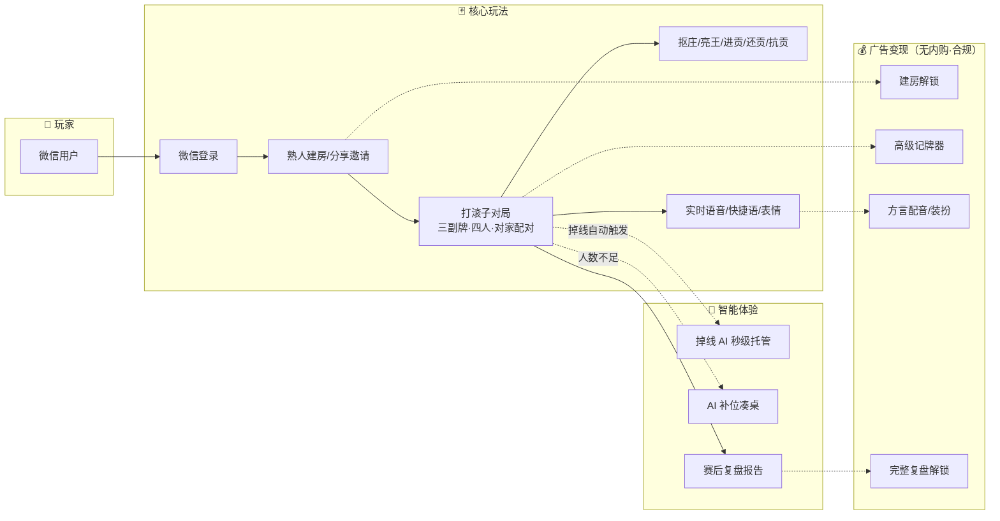
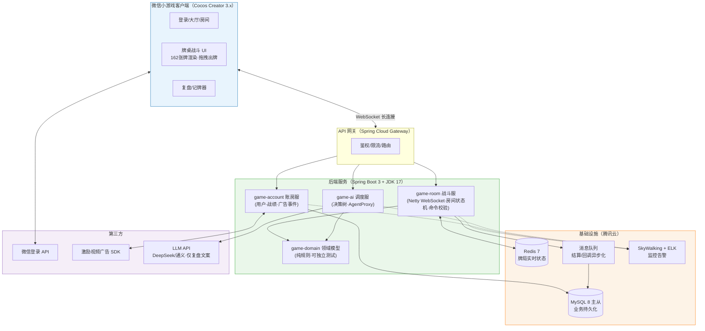
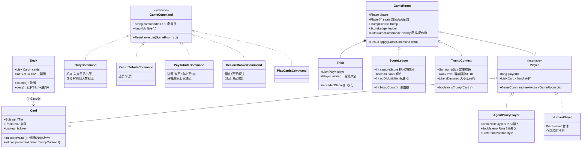
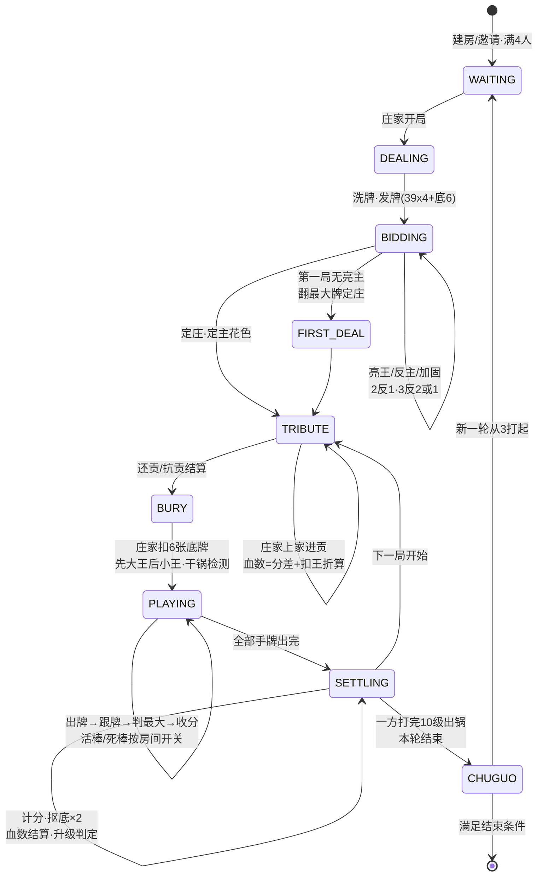
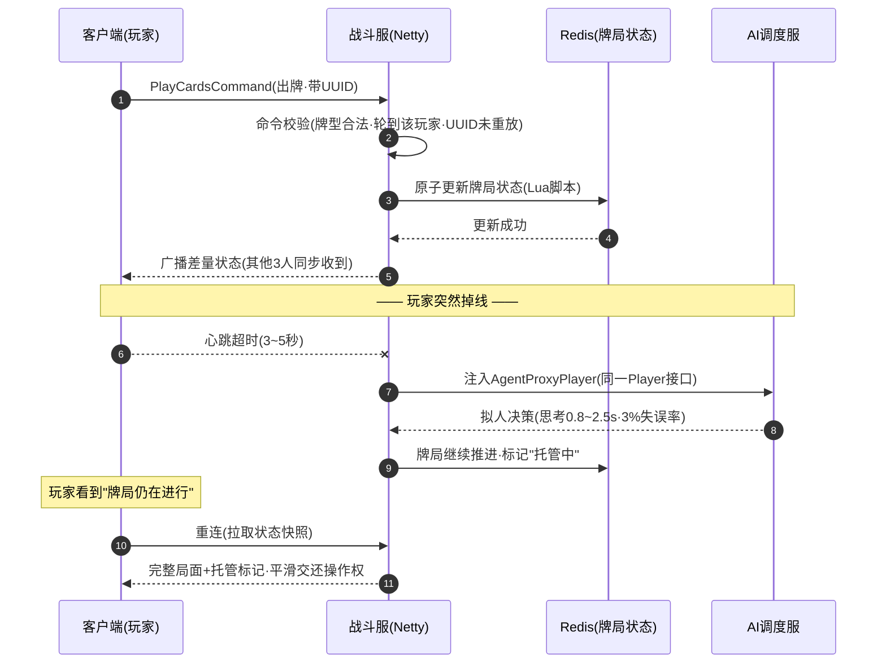
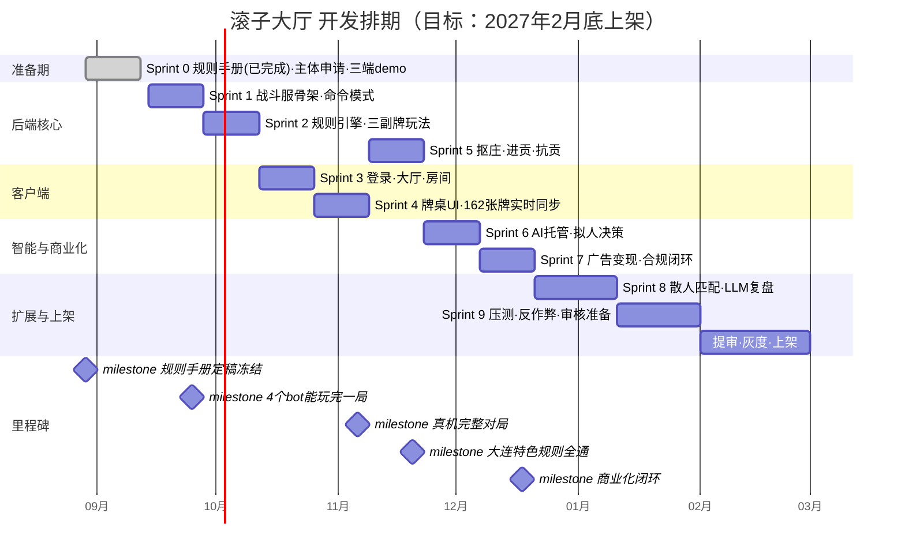

# 滚子大厅 - 项目 UML 图集

> 面向甲方 / 项目干系人的可视化文档  
> 所有图均为 Mermaid 源码，GitHub 自动渲染；修改图 = 修改文本，永远和代码同仓库演进  
> 绘制日期：2026-08-29 ｜ 依据：架构v0、WBS-v0、规则手册 v1.1（已定稿冻结）

---

## 1. 功能全景图（用例视角）

玩家能在这个小游戏里做什么——一张图讲清楚产品边界。

**给甲方的三个要点**：
- **零门槛进入**：微信扫码即玩，无需下载安装
- **不缺人**：掉线 AI 托管 + AI 补位，牌桌永远开得起来
- **合规变现**：全部收入来自激励视频广告，无充值、无内购、不涉赌

---

## 2. 系统架构图

**架构决策要点**：
- **服务器权威**：所有出牌命令必须服务端校验后生效，客户端只是"显示器"——从根上防外挂
- **规则引擎独立**（game-domain）：不依赖网络和数据库，可全量单元测试，规则手册 12 项决议逐一对应测试用例
- **AI 与真人同接口**：房间状态机不区分人机，断线托管零成本切换

---

## 3. 领域模型类图（DDD Lite + 命令模式）

**为什么用命令模式**：每个玩家动作（出牌/亮王/进贡…）都是一个可序列化对象 → 天然支持**回放、反作弊审计、断线重演**，这是棋牌类产品的合规底线。

---

## 4. 一局牌的完整状态机

**状态机与规则手册的对应**：每个状态转移都来自规则手册 v1.1 定稿条款（已冻结），Sprint 1-5 将逐状态实现并配单元测试。

---

## 5. 关键场景时序图：出牌 + 断线 AI 托管

甲方最关心的体验问题——"玩家掉线了牌局会散吗？"——答案在这张图里：**不会，AI 无感接管，重连无缝回来**。

---

## 6. 项目进度甘特图（WBS v0）

**当前进度（2026-08-29）**：
- ✅ 架构设计 v0、WBS v0（10 个 Sprint）
- ✅ **规则手册 v1.1 定稿冻结**（12 项规则决议全部拍板——项目最大风险已消除）
- ✅ 代码仓库建立（GitHub 自动化部署就绪）
- ⏳ 微信小游戏主体注册（甲方协助项）
- 📍 下一站：Sprint 1 领域模型 + 命令模式骨架（9 月中旬完成）

---

## 图集维护约定

| 变更场景 | 操作 |
|---|---|
| 新增/修改功能 | 先改本图集，评审后再动代码 |
| Sprint 结束 | 更新甘特图 done 状态和"当前进度" |
| 规则变更 | 规则手册已冻结，需走变更记录并同步状态机/类图 |
