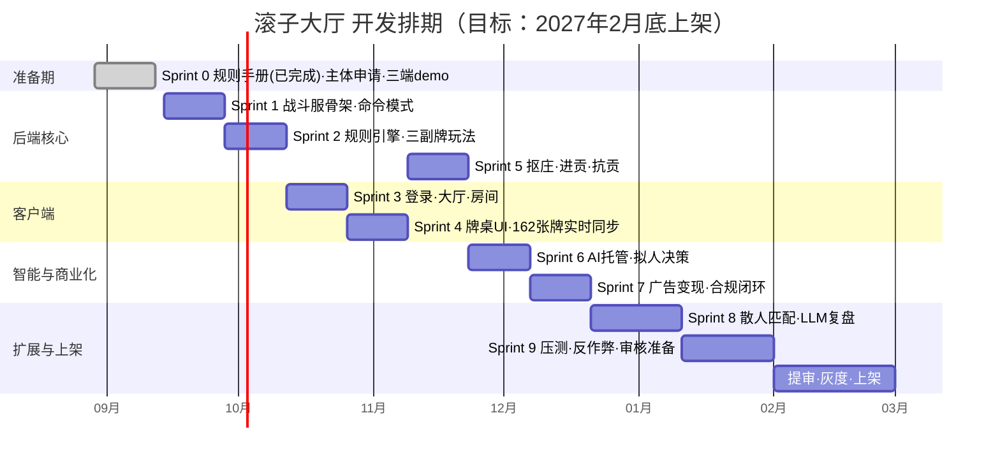

# 滚子大厅 (Gunzi Hall)

大连打滚子扑克牌游戏 —— 微信小程序。

> 打滚子：起源于辽宁大连的四人扑克游戏，三副牌 162 张，对家两两配对，抠庄、进贡、亮王、出锅。

## 项目概况

| 项 | 内容 |
|---|---|
| 产品形态 | 微信小游戏（Cocos Creator 3.x） |
| 后端 | Spring Boot 3 + Netty WebSocket + MySQL + Redis |
| 商业模式 | 合规广告变现（建房解锁 / 记牌器 / 赛后复盘），无内购 |
| 交付目标 | 2027-02 底前上架 |

## 游戏规则速览

- 三副牌共 162 张，4 人对家两两配对
- 级数序列：3 → 4 → 5 → 6 → 7 → 8 → 9 → 10（打完 10 出锅）
- 分牌：5（5分）、10（10分）、K（10分），满分 300
- 抓分方 ≥120 分且抠底则升级；庄家方守住 <120 分则升级
- 详见 [规则手册](01-规则手册/打滚子规则手册-v1.1-定稿.md)

## 文档目录

```
00-项目说明/    架构设计、WBS 任务分解
01-规则手册/    游戏规则（已定稿冻结）
02-设计文档/    UML 图集（功能全景/架构/类图/状态机/时序/进度甘特）
server/         后端工程（Maven 多模块，Sprint 1 起）
```

## 后端构建（server/）

```bash
cd server
mvn test   # JDK 17 + Maven 3.9+，36 个单元测试
```

当前模块：`game-domain` —— 领域模型（牌/牌值比较器/发牌/命令模式/计分/进贡血数），
唯一规则依据为已冻结的规则手册 v1.1。后续模块按 WBS 陆续加入：
`game-room`（Netty 战斗服）、`game-account`、`game-ai`、`game-common`。

## 📊 项目图集（甲方可直达）

全部图表见 **[02-设计文档/项目UML图集.md](02-设计文档/项目UML图集.md)**，包含：

1. 功能全景图——产品边界与商业化路径
2. 系统架构图——技术栈与模块拆分
3. 领域模型类图——命令模式设计
4. 牌局状态机——一局打滚子的完整生命周期
5. 关键时序图——出牌校验 + 断线 AI 托管
6. 项目进度甘特图——排期与里程碑

当前进度一图流：



## 开发计划（Sprint）

详见 [WBS-v0](00-项目说明/WBS-v0.md)：Sprint 0 准备期 → Sprint 9 上架准备，共 10 个迭代。

## License

私有项目，未授权不得使用。
