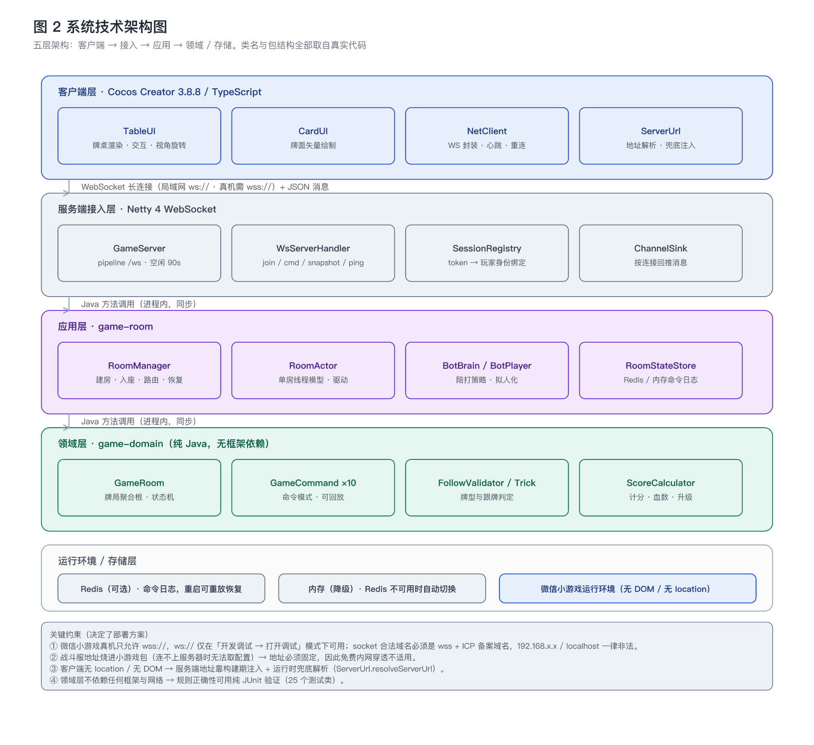
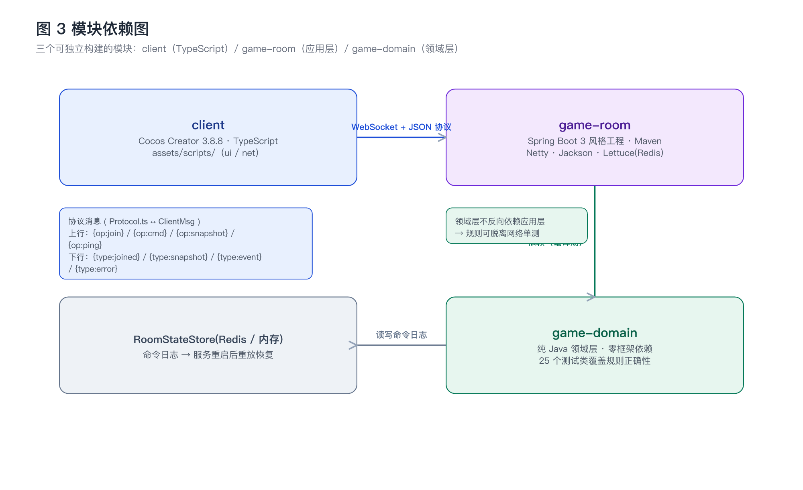
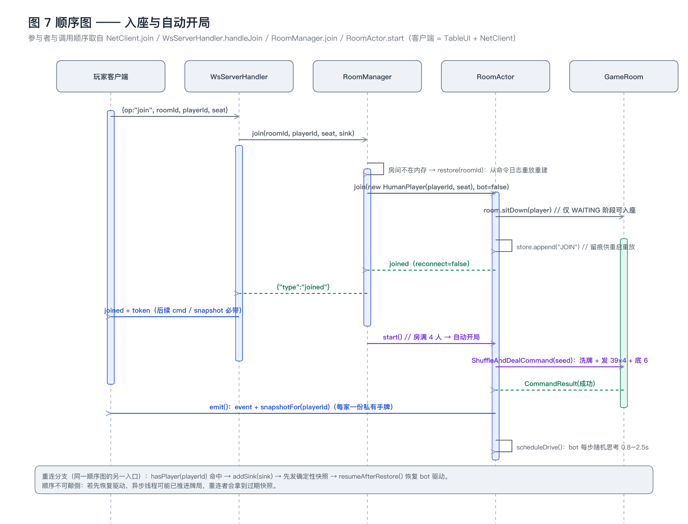
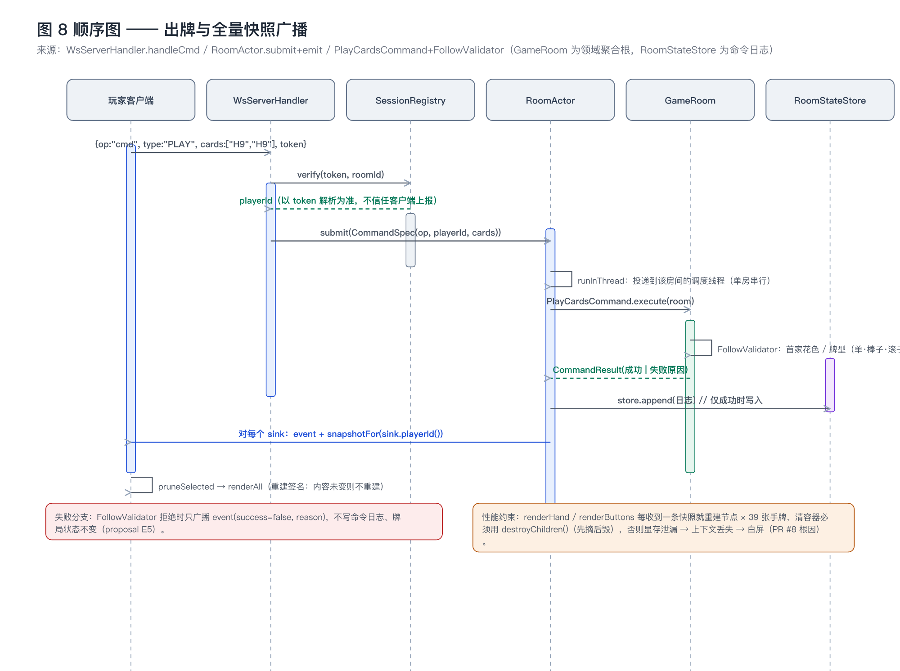
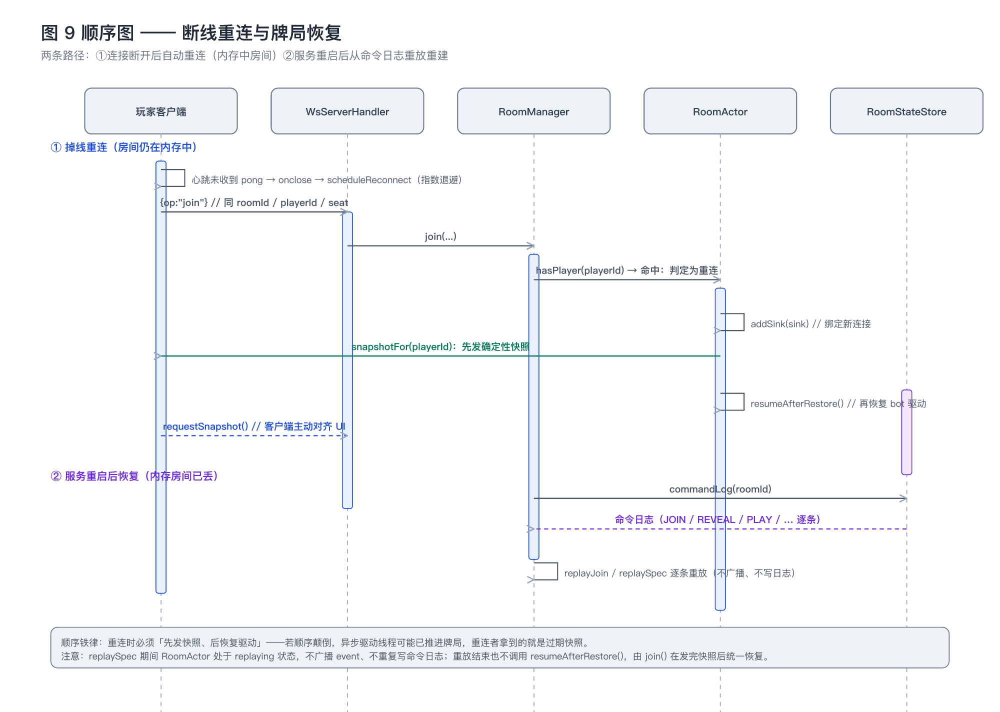
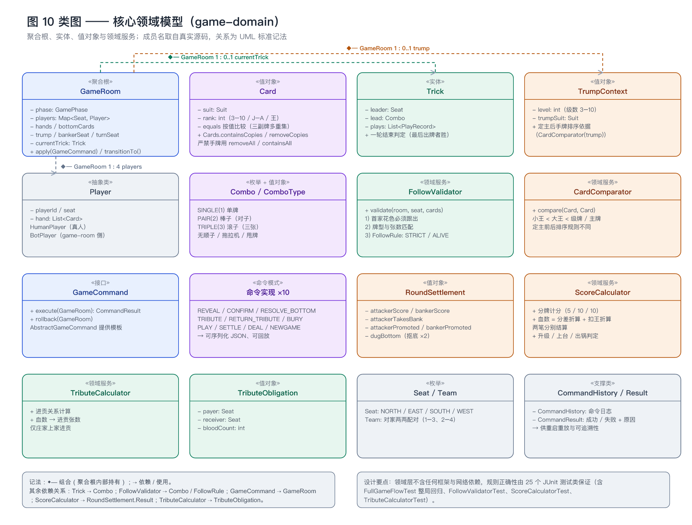
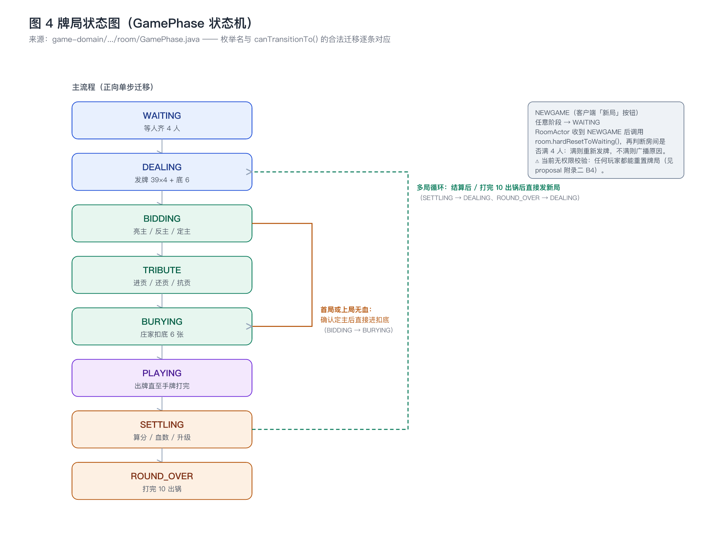
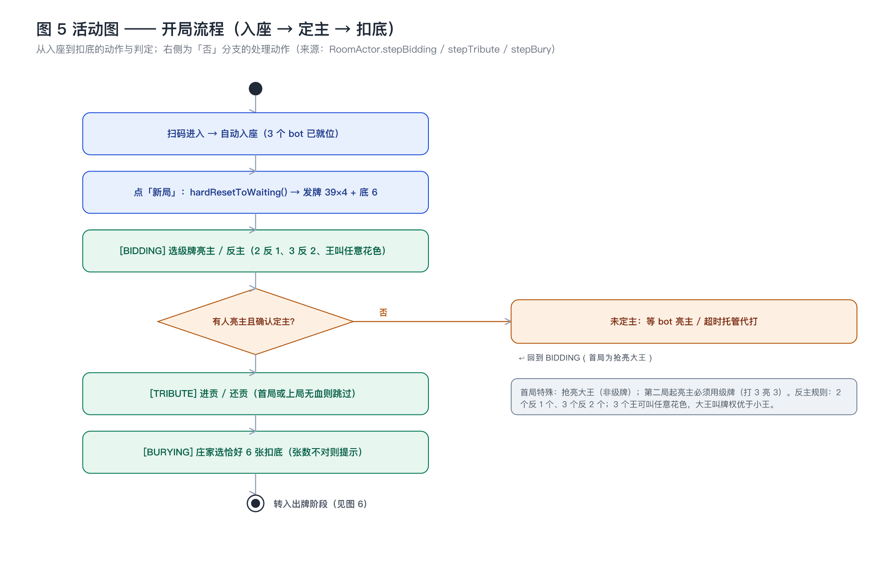
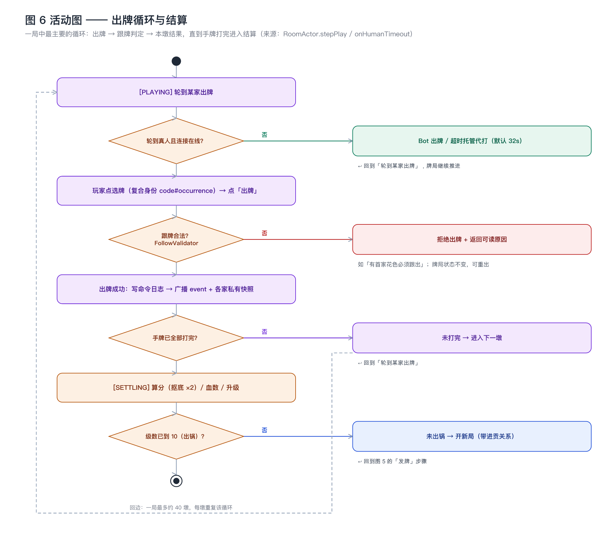
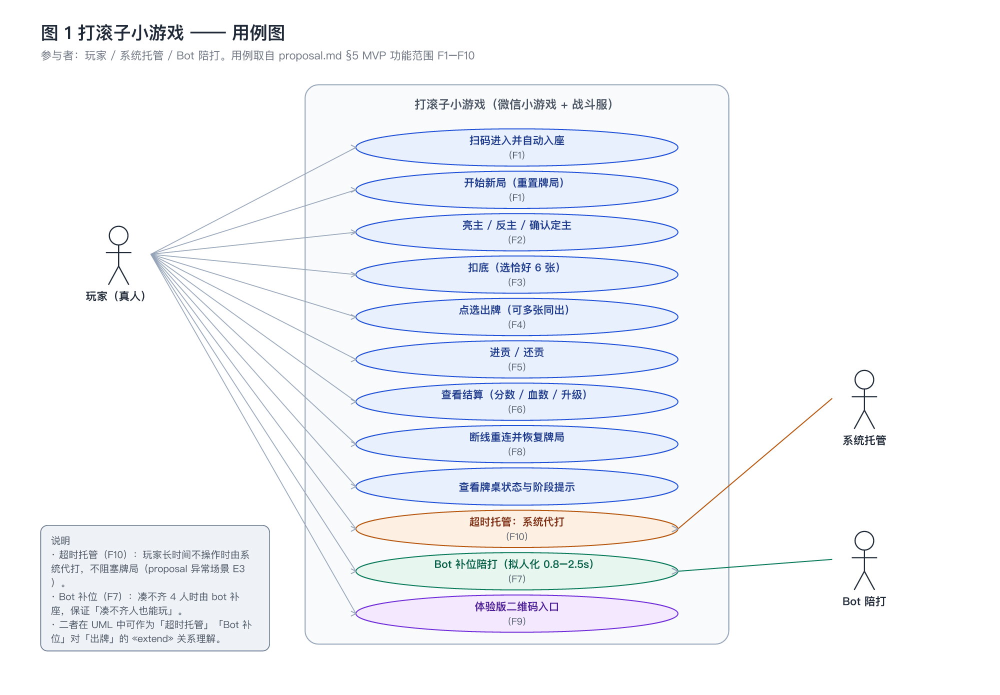

# 滚子大厅 设计说明（design）

> 本文档回答「**用什么技术、模块如何协作**」。需求见 `proposal.md`，任务拆解见 `tasks.md`，执行规则见 `project_rules.md`。
>
> **事实来源**：本文所有类名、字段名、协议字段、状态名均取自仓库真实代码（`server/` 与 `client/`），
> 与 `proposal.md` §5 的功能编号（F1–F10）和 §8 的异常场景（E1–E8）一一对应。
>
> **图件**：全部由 `tools/gen_diagrams.py` 生成（可重跑），SVG + PNG 双份存于 `docs/diagrams/`。
> 图件同时用作「软件工程 SDD 项目案例」的教学材料。

---

## 1. 技术选型及理由

| 层 | 选型 | 理由 | 不选什么的理由 |
|---|---|---|---|
| 客户端引擎 | **Cocos Creator 3.8.8 + TypeScript** | 一套工程可同时产出微信小游戏与桌面预览；横屏 2D 牌桌算力富余；牌面用矢量 Graphics 绘制，不依赖大图资源 | 不用原生小游戏框架：需要自行处理渲染/资源/生命周期，重复造轮子 |
| 客户端网络 | **原生 WebSocket（`NetClient` 封装）** | 微信小游戏支持 `wx.connectSocket`/标准 WebSocket；消息量小（仅牌局状态） | 不用 HTTP 轮询：牌局需要服务端主动推送（别人出牌要立刻可见） |
| 服务端语言/运行时 | **Java 17（arm64 JDK）** | 与该机型匹配（系统 JDK 21 为 x86_64 坏件）；LTS 稳定 | — |
| 长连接框架 | **Netty 4** | Netty 原生 WS 支持 + `IdleStateHandler` 空闲探测；单机长连接成本低 | 不用 Spring WebSocket：缺空闲探测与 pipeline 级控制 |
| 工程组织 | **Maven 多模块（`game-domain` / `game-room`）** | 领域层零框架依赖 → 规则可脱离网络用 JUnit 验证；应用层可替换 | 不用单模块：规则测试会被框架依赖拖慢、易被网络代码污染 |
| 序列化 | **Jackson（`JsonUtil`）** | 与 Netty 无关的纯工具类，可单测 | — |
| 状态存储 | **`RoomStateStore`：Redis（Lettuce）优先，不可用则内存降级** | 命令日志落 Redis 可让战斗服重启后重放恢复（E2/发布后运维需要） | 不用 MySQL：本期无账号体系、无跨局战绩（proposal N4）；不引入消息队列：单房串行已足够 |
| 测试 | **JUnit 5（领域 25 个测试类 + 应用层 4 个）** | 规则正确性是本项目的最大风险点，必须能自动化回归 | — |

**依赖清单（服务端）**：netty-all、jackson、lettuce（Redis）。**无 MySQL、无 Spring 容器**——`game-room` 以
`ServerMain` 直接启动（`mvn -pl game-room exec:java` 或 `java -jar gunzi-server.jar`，部署机只需 JDK 17）。

---

## 2. 总体架构



> 还可查看矢量版 `diagrams/02-architecture.svg`（放大不失真，适合放进 PPT）。

分层职责（自上而下）：

| 层 | 职责 | 关键约束 |
|---|---|---|
| 客户端层 | 牌桌渲染与交互、视角旋转、地址解析、连接管理 | 无 DOM、无 `location`；`TableUI.ts` 为渲染与交互的唯一入口 |
| 服务端接入层 | WS 握手、消息分发、令牌校验、按连接回推 | pipeline 固定顺序：`HttpServerCodec → HttpObjectAggregator → WebSocketServerProtocolHandler("/ws") → IdleStateHandler(90s) → WsServerHandler` |
| 应用层 | 房间生命周期、玩家入座/重连、命令投递、bot 驱动、快照广播 | 单房串行（见 §10） |
| 领域层 | 牌局状态机、牌型与跟牌判定、计分与血数、进贡 | 零框架依赖，纯 JUnit 可测 |
| 运行环境 / 存储 | Redis 命令日志（可选）、内存降级、微信小游戏运行环境 | 无 Redis 时自动降级，不影响可玩性 |

**部署形态（两种）**

1. **当前（体验版自娱 / 局域网）**：战斗服跑在任老师电脑（`ServerMain`，端口 8080，路径 `/ws`），
   手机与电脑同一 WiFi，客户端连 `ws://<局域网IP>:8080/ws`。真机需在微信里「开发调试 → 打开调试」才能连明文 `ws://`。
2. **未来（朋友零操作）**：云服务器固定公网 IP + 域名 + ICP 备案 + SSL → `wss://`。**本期不做**（proposal N1）。

---

## 3. 模块划分与职责



### 3.1 模块边界

| 模块 | 语言 / 构建 | 职责 | 依赖 |
|---|---|---|---|
| `client` | TypeScript / Cocos | 渲染、交互、网络封装、地址解析 | 仅通过 WS 协议与 `game-room` 通信，**不引用任何 Java 代码** |
| `game-room` | Java / Maven | 房间管理、连接管理、bot 驱动、超时托管、命令分发、状态持久化 | → `game-domain`；→ Redis（可选） |
| `game-domain` | Java / Maven | 牌局聚合根、命令模式、规则判定、计分、进贡 | **无外部依赖（不反向依赖应用层）** |

### 3.2 关键类职责

| 类 | 模块 | 职责 |
|---|---|---|
| `ServerMain` | game-room | 启动入口；参数：`port`（默认 8080）、`roomId`（默认 1001）、`turnTimeoutMs`（默认 32000，验收可传 1500 加速） |
| `GameServer` | game-room | Netty 服务装配与生命周期（boss/worker group、pipeline、优雅关闭） |
| `WsServerHandler` | game-room | 消息分发：`ping` / `join` / `cmd` / `snapshot`；把 Channel 包装为 `ChannelSink` |
| `SessionRegistry` | game-room | token → (roomId, playerId) 绑定与校验（TTL 12h，进程内存储） |
| `RoomManager` | game-room | `roomId → RoomActor` 路由；建房（指定 bot 座位）、真人入座、命令分发、重启恢复 |
| `RoomActor` | game-room | 单个房间的**串行执行器**：驱动循环、阶段推进、bot 与真人分流、超时托管、快照广播、命令日志写入 |
| `BotPlayer` / `BotBrain` | game-room | bot 身份与出牌策略（首出 / 跟牌） |
| `RoomStateStore` | game-room | 命令日志读写；`RedisStateStore`（可用时）与 `InMemoryStateStore`（降级）两实现 |
| `GameRoom` | game-domain | 牌局聚合根：阶段、四家手牌、底牌、主牌、当前墩、捡分、进贡关系、结算结果 |
| `GameCommand`（+10 实现） | game-domain | 命令模式：`execute(room)` / `rollback(room)`，可序列化为 JSON 供重放 |
| `FollowValidator` / `Trick` / `Combo` | game-domain | 牌型（单/棒子/滚子）识别与跟牌合法性判定 |
| `TrumpContext` / `CardComparator` | game-domain | 主牌上下文与排序（定主前后排序规则不同） |
| `ScoreCalculator` / `RoundSettlement` | game-domain | 计分（5/10/10）、血数（分差折算 + 扣王折算）、升级与抠底 ×2 |
| `TributeCalculator` | game-domain | 进贡关系与张数（仅庄家上家进贡） |

---

## 4. 端到端数据流

### 4.1 入座与自动开局



关键设计点：

- **房间可恢复**：`RoomManager.join` 发现房间不在内存时，先用 `restore(roomId)` 从命令日志重放重建，再入座。
- **开局条件**：房间满 4 人（`room.isFull()`）时由 `start()` 发牌并启动 bot 驱动；不满则只回快照。
- **快照按人定制**：`emit()` 对**每个连接**发送 `snapshotFor(sink.playerId())`，各人只看到自己的 `yourHand`。

### 4.2 出牌与全量快照广播（核心链路）



一条 `PLAY` 命令的完整路径：

```
客户端 sendCmd('PLAY', {cards})            // 自动附带 token
  → WsServerHandler.handleCmd
      → SessionRegistry.verify(token, roomId) → playerId   // 不信任客户端上报的 playerId
  → RoomActor.submit(CommandSpec)            // 投递到该房间的调度线程（单房串行）
      → PlayCardsCommand.execute(room)
          → FollowValidator 校验（首家花色 / 牌型 / 张数）
      → 成功：store.append(命令日志) → emit(event + 每个 sink 的私有快照)
      → 失败：只 emit(event, success=false, reason)，不写日志、状态不变
  → 客户端 onSnapshotMsg → pruneSelected → renderAll（重建签名：内容未变则不重建）
```

### 4.3 断线重连与服务重启恢复



两条恢复路径，**顺序不可颠倒**：

1. **掉线重连（房间仍在内存）**：`hasPlayer(playerId)` 命中 → `addSink(sink)` → **先发确定性快照** → `resumeAfterRestore()` 恢复 bot 驱动。
2. **服务重启（内存房间已丢）**：`commandLog(roomId)` → 逐条 `replayJoin` / `replaySpec` 重放；重放期间 `replaying=true`，**不广播、不重复写日志**；重放结束也不调用 `resumeAfterRestore()`，由 `join()` 在发完快照后统一恢复。

> 若顺序颠倒（先恢复驱动再发快照），异步驱动线程可能已推进牌局，重连者将拿到过期快照。

---

## 5. 核心数据结构



### 5.1 牌编码（客户端 `Protocol.CardCodec` ↔ 服务端 `CardCodec`）

| 编码 | 含义 | 示例 |
|---|---|---|
| `<S><R>` | 花色 + 点数 | `S14`（黑桃 A）、`H5`（红桃 5）、`D10`、`C13` |
| `BJ` / `SJ` | 大王 / 小王 | `BJ`（大王，叫牌权优于小王）、`SJ` |

**三副牌多重集铁律**：`Card` 按值 `equals`，同一编码最多出现 3 次（三副牌）。
手牌**严禁使用 `removeAll` / `containsAll`**，必须用 `Cards.containsCopies` / `Cards.removeCopies`。

### 5.2 牌型（只有三种）

| 牌型 | 张数 | 说明 |
|---|---|---|
| `SINGLE` | 1 | 单牌 |
| `PAIR` | 2 | **棒子**（两张点数与花色都相同） |
| `TRIPLE` | 3 | **滚子**（三张同点同花，游戏名由来） |

**无顺子、无拖拉机、无泰坦尼克、无甩牌**——这是与「升级/拖拉机」的核心区别。

### 5.3 快照消息（`type: "snapshot"`）

| 字段 | 含义 |
|---|---|
| `phase` / `gameNumber` / `level` | 阶段、第几局、当前级数（3–10） |
| `trump` / `reveal` | 主牌（级数 + 花色）、亮主反主状态 |
| `banker` / `turn` | 庄家座位、当前行动座位 |
| `followRule` | 跟牌规则（`STRICT` / `ALIVE`） |
| `hands` | 四家余牌数（公开信息） |
| `yourHand` | **私有**手牌（仅本人可见，已按主牌排序） |
| `trick` | 当前墩：`leader` / `leadCards` / `plays[]` |
| `trickPoints` / `pendingTributes` | 各队已捡分、待进贡关系 |
| `settlement` | 上一局结算（分数 / 上台 / 升级 / 抠底） |

### 5.4 命令日志（`RoomStateStore` 落盘格式）

`JOIN` 记录：`{op:"JOIN", playerId, seat, bot}`；
游戏命令记录：`{op, playerId, cards?, suit?, payee?, indexes?, seed?}`。
整局可由此日志**逐条重放**，是重启恢复与问题回溯的唯一依据。

---

## 6. 关键接口设计

### 6.1 WebSocket 协议（`Protocol.ts` 与 `ClientMsg` / 快照 / 事件对齐）

**上行（客户端 → 服务端）**

| 消息 | 字段 | 说明 |
|---|---|---|
| `join` | `roomId, playerId, seat` | 入座；成功后签发 token |
| `ping` | — | 心跳（服务端回 `pong`） |
| `snapshot` | `roomId, token` | 主动要全量快照（UI 自救） |
| `cmd` | `type, roomId, token, cards?, suit?, payee?, indexes?, seed?` | 游戏命令 |

**`cmd.type` 取值**：`DEAL` / `REVEAL` / `CONFIRM` / `RESOLVE_BOTTOM` / `TRIBUTE` / `RETURN_TRIBUTE` / `BURY` / `PLAY` / `SETTLE` / `NEWGAME`。

**下行（服务端 → 客户端）**

| 消息 | 说明 |
|---|---|
| `joined` | `reconnect, token, roomId, playerId, seat?` |
| `snapshot` | 见 §5.3 |
| `event` | `op, success, reason, seat, playerId, cards, phase, gameNumber, level` |
| `error` | `reason`（如 token 无效、座位被占、牌局已开始） |

### 6.2 领域命令接口（`GameCommand`）

```java
public interface GameCommand {
    CommandResult execute(GameRoom room);   // 执行
    CommandResult rollback(GameRoom room);  // 回滚（部分实现，用于测试与容错）
}
```

10 个实现：`ShuffleAndDealCommand`、`RevealTrumpCommand`、`ConfirmTrumpCommand`、`ResolveTrumpFromBottomCommand`、
`TributeCommand`、`ReturnTributeCommand`、`BuryBottomCommand`、`PlayCardsCommand`、`SettleRoundCommand`、`NEWGAME`（RoomActor 直接处理）。

### 6.3 回推接口（`RoomActor.Sink`）

```java
public interface Sink {
    long playerId();      // 该连接代表的玩家（快照按此定制）
    void send(String json); // 回推一条 JSON 消息
}
```

`WsServerHandler.ChannelSink` 是其在接入层的实现：一个连接一个 Sink，断线重连后生成新 Sink 绑定新 Channel。

---

## 7. 状态流转



阶段与合法迁移**全部声明在 `GamePhase.canTransitionTo()`** 中，非法迁移直接被拒绝：

| 当前 | 允许迁移到 | 说明 |
|---|---|---|
| `WAITING` | `DEALING` | 满 4 人开局（或收到 `NEWGAME`） |
| `DEALING` | `BIDDING` | 发牌 39×4 + 底 6 |
| `BIDDING` | `TRIBUTE`、`BURYING` | 首局或上局无血 → **跳过进贡直接扣底** |
| `TRIBUTE` | `BURYING` | 进贡 / 还贡 / 抗贡完成 |
| `BURYING` | `PLAYING` | 庄家扣底恰好 6 张 |
| `PLAYING` | `SETTLING` | 手牌全部打完 |
| `SETTLING` | `ROUND_OVER`、`DEALING` | 打完 10「出锅」或直接开新局 |
| `ROUND_OVER` | `DEALING` | 重新开局 |
| 任意 | `WAITING` | `NEWGAME` → `room.hardResetToWaiting()`（⚠ 当前无权限校验） |

**开局流程与出牌循环**分别见图 5、图 6（活动图）。





---

## 8. 错误处理

| 类别 | 场景 | 处理方式 | 对应需求 |
|---|---|---|---|
| 非法操作 | 未跟首家花色、扣底张数不对、座位已占、牌局已开始 | 服务端返回**可读原因**（`event.reason` / `error.reason`），**牌局状态不变** | E5、A10 |
| 命令运行时异常 | 领域命令抛异常 | `applyLogged` 捕获 → `CommandResult.fail("命令执行异常: …")`；`RoomActor.runInThread` 兜底捕获 → 广播 `ERROR` | — |
| 驱动异常 | bot 找不到合法跟牌、状态损坏 | 显式置 `stuck=true` 并广播 `BOT_STUCK` / `DRIVE_ERROR`（避免调度器静默吞异常导致「无声卡局」） | — |
| 网络异常 | 掉线、切后台 | 客户端心跳 + 指数退避重连；服务端 90s 读空闲断开；重连后自动恢复牌局 | E1、E2、A9 |
| 令牌失效 | 服务重启 / TTL 过期 | 服务端回 `error: 无效或缺失 token`；客户端自动重新 `join` | E2 |
| 渲染上下文丢失 | 显存耗尽 | `installContextLostGuard()` 监听 `webglcontextlost` → 提示并自动刷新一次（sessionStorage 防无限刷新） | E4 |

> **历史教训（已修复并通过测试固化）**：`RoomActor.submit` 的 `runInThread(() -> {…})` 曾静默吞掉运行时异常
> （无 error 回包、无日志），导致「新命令完全无响应」被误判为「命令没到」。现在所有异常路径都必须显式广播。

---

## 9. 权限、安全与隐私

| 项 | 设计 |
|---|---|
| 身份绑定 | `join` 成功签发 UUID token，绑定 `(roomId, playerId)`，TTL 12h；后续 `cmd` / `snapshot` 必带 token |
| 不信任客户端 | `cmd` 的 `playerId` **以 token 解析结果为准**，客户端上报的 `playerId` 被忽略 |
| 攻击面测试 | `SessionAuthTest` 覆盖三层：①无 token 调用 ②伪造 token ③持自己 token 谎报他人 playerId 出牌 |
| 隐私 | 不采集个人信息、不请求敏感权限、无账号体系（proposal N4/N9）；牌局数据仅存于服务端内存 / Redis |
| 已知缺口 | `NEWGAME` 无权限校验：任何玩家都能重置牌局（多真人场景需限定庄家/房主，见 `proposal.md` 附录二 B4） |

---

## 10. 性能考虑与降级方案

| 关注点 | 现状与对策 |
|---|---|
| **单房并发** | `RoomActor` 以单线程调度器串行处理该房间的所有命令 → **无需加锁**，也天然避免同一房间的状态竞争 |
| **快照开销** | 走「全量快照 + 重建签名」：内容未变则不重建节点；出牌/结算等关键动作后广播 |
| **显存（最大风险）** | `renderHand` / `renderButtons` 每收到快照都会重建节点 × 39 张手牌 → 清容器**必须**用 `TableUI.destroyChildren()`（先 `removeAllChildren()` 摘除，再逐个 `Tween.stopAllByTarget + destroy()`），否则 Graphics 顶点缓冲 / MaterialInstance / Label 贴图永不归还显存 → 上下文丢失 → 白屏（已由 PR #8 修复并长跑验证） |
| **包体** | 主包 4MB 为真机硬上限（错误码 80051），当前 **1.74MB**；靠 `engine.json` 裁剪（关 3d / physics / spine），构建脚本带体积守卫 |
| **首屏资源** | 本地预览必须用 `tools/serve.py`（HTTP/1.1 + Keep-Alive + 逐请求日志），避免 HTTP/1.0 下并发拉 ~14 个资源偶发失败导致卡 splash |
| **bot 拟人化** | 每步随机思考 0.8–2.5s（`RoomManager.setThinkTime`），避免「瞬出十几张」的机械感 |
| **验收加速** | `ServerMain` 第 3 参数 `turnTimeoutMs` 可把超时托管压到 1.5s，让人不动也能几分钟走完一局 |
| **存储降级** | `RedisStateStore.available()` 为假时自动切 `InMemoryStateStore`，功能不中断（代价：重启后无法恢复） |

---

## 11. 目录结构

```
扑克游戏小程序/
├── docs/                         # SDD 规范产物
│   ├── proposal.md               # 做什么（已定稿）
│   ├── design.md                 # 怎么做（本文档）
│   └── diagrams/                 # 图件（SVG + PNG，由 tools/gen_diagrams.py 生成）
├── client/                       # Cocos Creator 3.8.8 工程
│   ├── assets/scripts/
│   │   ├── ui/TableUI.ts         # 牌桌渲染 / 交互 / 视角旋转（3156 行，已登记技术债 N9）
│   │   ├── ui/CardUI.ts          # 牌面矢量绘制
│   │   └── net/{NetClient,Protocol,ServerUrl}.ts
│   └── build-wechatgame.sh       # 唯一允许的微信小游戏构建入口（.ps1 为 Windows 版）
├── server/
│   ├── game-domain/              # 领域层（零框架依赖，25 个测试类）
│   └── game-room/                # 应用层 + 接入层（Netty）
└── tools/
    ├── gen_diagrams.py           # 图件生成器（本套 UML 图可一键重跑）
    ├── serve.py                  # 本地静态服务器（HTTP/1.1）
    └── ws_probe.py               # 零依赖 WS 探针（分层定位连不上问题）
```

---

## 12. 需求-方案对应关系



上图给出**功能边界**（玩家可见的用例与两个非人类参与者：系统托管、Bot 陪打）；
下表把每条需求落到具体设计点上，保证「需求 → 设计 → 代码」可追溯：

| 需求（proposal） | 设计落点 | 对应图 | 状态 |
|---|---|---|---|
| F1 入座与开局 | `RoomManager.join` + `RoomActor.start` / `NEWGAME` | 图 5、图 7 | ✅ 已实现 |
| F2 定主（亮主/反主） | `RevealTrumpCommand` / `ConfirmTrumpCommand` / `ResolveTrumpFromBottomCommand` | 图 4、图 5 | ✅ 已实现，真机未完整验证 |
| F3 扣底 | `BuryBottomCommand`（校验恰好 6 张） | 图 5 | ✅ 已实现 |
| F4 出牌与跟牌 | `PlayCardsCommand` + `FollowValidator`（首家花色 / 牌型 / 张数） | 图 6、图 8 | ✅ 真机出牌已通过 |
| F5 进贡 / 还贡 | `TributeCalculator` → `TributeCommand` / `ReturnTributeCommand` | 图 5 | ✅ 领域已实现，真机未验证 |
| F6 抠底与结算 | `SettleRoundCommand` + `ScoreCalculator` + `RoundSettlement` | 图 6 | ✅ 领域已实现，真机未验证 |
| F7 Bot 补位 | `BotPlayer` / `BotBrain` + `setThinkTime(800,2500)` | 图 1、图 5 | ✅ 已实现（拟人化约 60%） |
| F8 断线重连 | `NetClient` 退避重连 + `RoomActor` 快照/重放恢复 | 图 9 | ✅ 已实现，真机未完整验证 |
| F9 熟人入口 | 构建脚本注入地址 + 微信体验版（`wss://` 约束见 §2 部署形态） | 图 2 | ⚠️ 未走通：朋友进体验版连不上（需开调试或备案域名） |
| F10 超时托管 | `turnTimeoutMs` + `armTimeout` / `onHumanTimeout`（按座位） | 图 1、图 6 | ✅ 已实现 |
| **F11 选中牌放大预览**（2026-09-20 新增） | `TableUI` 手牌渲染的选中态：由「上移 12px」改为**尺寸放大**；⚠️ 命中区需同步调整（既有约束：缩命中区时子节点必须一起缩） | — | 🆕 本期新增，**仅客户端改动** |
| **F12「主牌N张」实时计数**（2026-09-20 新增） | 顶栏由快照的 `yourHand` + `trump` **客户端本地计算**主牌张数，随快照刷新；**无需改协议、无需改服务端** | — | 🆕 本期新增，**仅客户端改动** |
| E1 连不上提示 | 顶栏显示实际地址与原因 + 「重试连接」 | — | ✅ |
| E2 掉线恢复 | 见 §4.3 | 图 9 | ✅ |
| E3 长时间不操作 | 超时托管代打，不阻塞牌局 | 图 6 | ✅ |
| E4 显存耗尽白屏 | `destroyChildren()` + `installContextLostGuard()` | 图 8 注 | ✅ 已修复 |
| E5 非法操作 | 返回可读原因，状态不变 | 图 6 | ✅ |
| E6 选牌不错位 | 复合身份 `code#occurrence` + `pruneSelected()` | — | ✅ |
| E7 人数不足 | bot 补位自动开局 | 图 1 | ✅ |
| E8 首帧空白 | 先回快照再恢复驱动；连接中显示状态与按钮 | 图 7 | ✅ |
| 非功能：包体 ≤4MB | engine.json 裁剪 + 构建脚本体积守卫 | — | ✅ 1.74MB |
| 非功能：安全 | `SessionRegistry` token 身份绑定 + `SessionAuthTest` | — | ✅ |
| 非功能：多真人（本期不做） | 见 `proposal.md` 附录二改动清单 B1–B4 | 图 2 | ⛔ 本期不做 |

---

## 附：尚未闭环的设计风险（诚实清单）

1. **「完整一局」端到端未在真机验证**：F2–F6 的领域实现与单测均通过，但真机上从未完整走完一局（关键路径）。
2. **F9 体验版入口未走通**：`ws://` 在真机非调试模式被屏蔽，需要「每人手动开调试」或部署 `wss://`。
3. **`TableUI.ts` 3156 行**超出 300 行约束（proposal N9，**2026-09-20 已确认本期不做**，转为已登记技术债：超过 4000 行 / 出现高频回归 / 需新增较大界面模块时再评估拆分）。
4. **多真人同桌**的 4 个缺口（B1–B4）已勘察但未实施（本期不做）。
5. 本文档与图件基于**代码现状**描述；若实现变更，需同步更新本文件与图件（图件可重跑 `tools/gen_diagrams.py`）。
